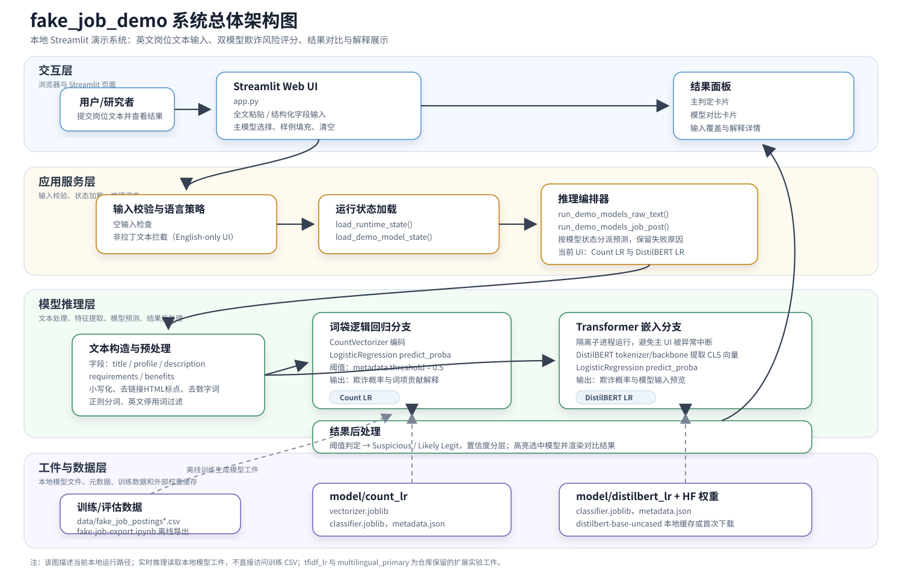

# fake_job_demo 系统总体架构图

**图注建议：** fake_job_demo 本地演示系统总体架构。系统以 Streamlit Web UI 作为交互入口，支持全文粘贴和结构化岗位字段输入；应用服务层负责输入校验、运行状态加载和多模型推理编排；模型推理层包含词袋逻辑回归分支与 DistilBERT 嵌入逻辑回归分支；工件层提供本地 `joblib` 模型、元数据和 Transformer 权重缓存，最终输出欺诈概率、风险标签、置信度和可解释性信息。

**使用说明：**

- `fake_job_demo_system_architecture.svg` 可直接插入论文或答辩材料。
- `fake_job_demo_system_architecture.mmd` 是 Mermaid 源文件，后续可继续修改模块名称或导出其他格式。
- 本图按当前 `app.py` 的英文双模型演示界面绘制；仓库中保留的 `tfidf_lr` 和 `multilingual_primary` 在图中作为扩展实验工件标注。
